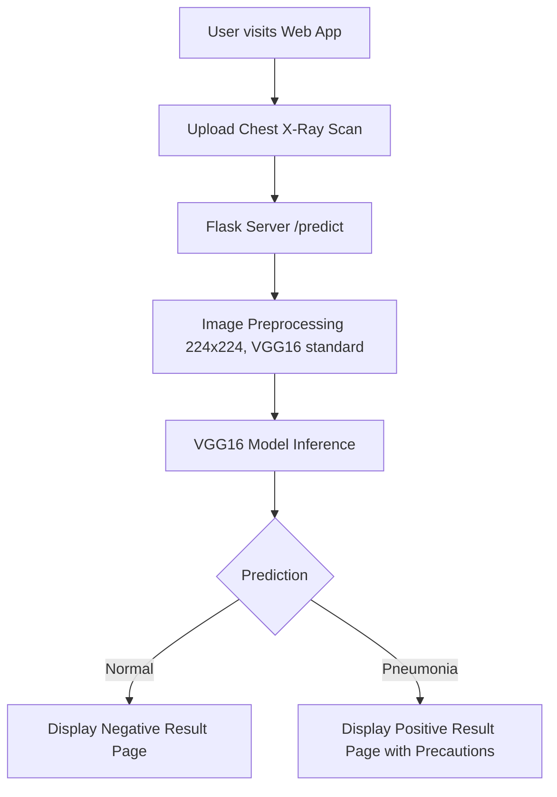

# 🩺 Pneumonia Detection from Chest X-Rays

[](https://www.python.org/)
[](https://flask.palletsprojects.com/)
[](https://www.tensorflow.org/)
[](https://keras.io/)
[](LICENSE)

An end-to-end deep learning web application that detects **Pneumonia** from chest X-ray radiographs. Built using **Transfer Learning with VGG16** in TensorFlow/Keras and served via a lightweight, interactive **Flask** web interface.

---

## 📌 Table of Contents

- [Overview](#-overview)
- [Key Features](#-key-features)
- [How It Works](#-how-it-works)
- [Project Structure](#-project-structure)
- [Tech Stack](#-tech-stack)
- [Installation & Setup](#-installation--setup)
- [Running the Application](#-running-the-application)
- [Model Training](#-model-training)
- [Medical Disclaimer](#-medical-disclaimer)
- [Author](#-author)

---

## 🌟 Overview

Pneumonia is an infection that inflames the air sacs in one or both lungs and can be life-threatening if not diagnosed early. This application simplifies early screening by allowing users or healthcare workers to upload a digital chest X-ray scan and receive real-time classification (Normal vs. Pneumonia) along with recommended health precautions.

---

## 🚀 Key Features

- **Transfer Learning Backbone:** Leverages pre-trained **VGG16** (trained on ImageNet) with custom classification layers fine-tuned on chest X-ray datasets.
- **Fast In-Memory Inference:** Model weights are loaded once in memory, providing fast inference times per scan.
- **Interactive Web Interface:** Clean UI with client-side image preview before submission.
- **Actionable Diagnostic Feedback:** Redirects to tailored result pages offering medical guidelines and precautions when pneumonia is flagged.

---

## 🧠 How It Works



1. **Upload:** User selects a `.jpg`, `.jpeg`, or `.png` chest X-ray image.
2. **Preprocessing:** The image is resized to $224 \times 224$ pixels and preprocessed according to VGG16 channel requirements.
3. **Inference:** The deep learning model computes class probabilities.
4. **Result:** The system routes the user to either:
   - **Negative (`/negative`):** Scan indicates no signs of pneumonia.
   - **Positive (`/positive`):** Scan indicates pneumonia patterns; precautions and treatment information are presented.

---

## 📁 Project Structure

```
pneumonia/
├── app.py                  # Flask web application & route handlers
├── Pneumonia.py            # Deep learning model training script (VGG16 transfer learning)
├── Test.py                 # Inference helper & model prediction logic
├── our_model.h5            # Serialized trained model weights
├── requirements.txt        # Python package dependencies
├── .gitignore              # Files & directories excluded from version control
├── templates/              # Jinja2 HTML templates
│   ├── index.html          # Landing / homepage
│   ├── upload.html         # Scan upload form with image preview
│   ├── positive.html       # Positive diagnosis page
│   └── negative.html       # Negative diagnosis page
└── static/                 # Static web assets
    ├── styles.css          # CSS styling
    ├── script.js           # Client-side JavaScript
    └── images/             # Images and branding assets
```

---

## 🛠 Tech Stack

- **Backend:** Python 3.10+, Flask
- **Deep Learning:** TensorFlow 2.x, Keras 3.x
- **Computer Vision & Processing:** NumPy, Pillow, Scikit-learn
- **Frontend:** HTML5, CSS3, JavaScript

---

## 💻 Installation & Setup

### 1. Clone the Repository

```bash
git clone https://github.com/syed-safwan-Master/pneumonia-detection.git
cd pneumonia-detection
```

### 2. Create and Activate a Virtual Environment

```powershell
# Windows (PowerShell)
python -m venv venv
.\venv\Scripts\Activate.ps1
```

```bash
# macOS / Linux
python3 -m venv venv
source venv/bin/activate
```

### 3. Install Dependencies

```bash
pip install -r requirements.txt
```

---

## 🖥 Running the Application

Start the Flask development server:

```powershell
python app.py
```

Open your browser and navigate to:
```
http://127.0.0.1:5000
```

1. Click **"Add Your Scan"**.
2. Select your chest X-ray scan.
3. Click **"Upload Scan"** to view your diagnosis.

---

## 📊 Model Training

To retrain the model with your own dataset:

1. Download the [Kaggle Chest X-Ray Images (Pneumonia)](https://www.kaggle.com/datasets/paultimothymooney/chest-xray-pneumonia) dataset.
2. Structure the directory as follows:
   ```
   chest_xray/
   ├── train/
   │   ├── NORMAL/
   │   └── PNEUMONIA/
   └── test/
       ├── NORMAL/
       └── PNEUMONIA/
   ```
3. Run the training script:
   ```powershell
   python Pneumonia.py
   ```
   This will train the model, plot training/validation metrics, and update `our_model.h5`.

---

## ⚠️ Medical Disclaimer

> **Disclaimer:** This software is developed for educational and academic research purposes only. It is **not** intended to replace clinical judgment, diagnosis, or treatment by a licensed physician or medical professional. Always consult a healthcare specialist for any medical condition.

---

## 👤 Author

Developed by **Syed Safwan**  
GitHub: [@syed-safwan-Master](https://github.com/syed-safwan-Master)
